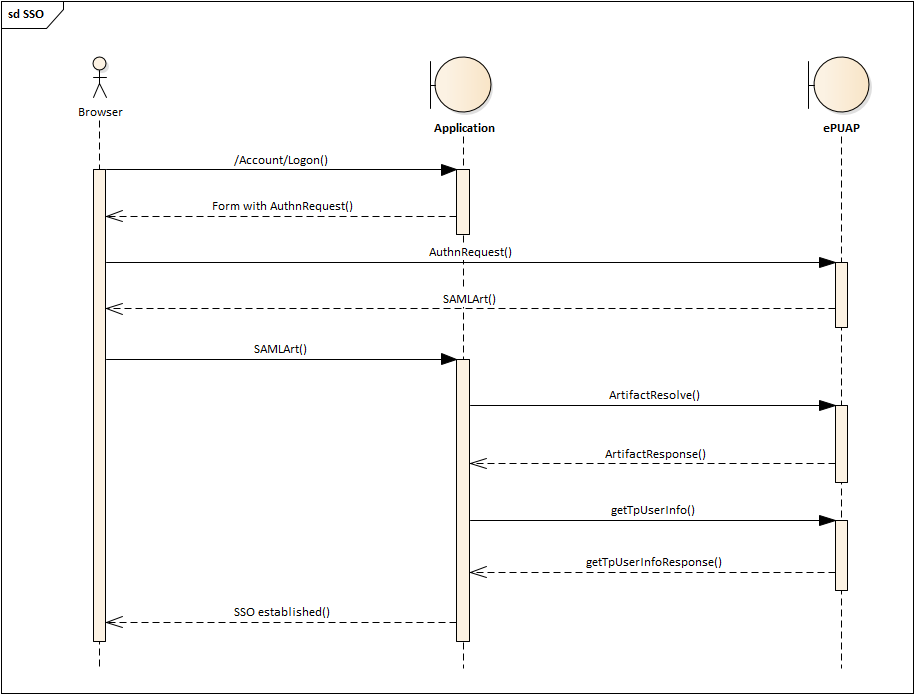

# OldMusicBox.ePUAP.Client, OldMusicBox.ePUAP.Client.Core

The goal of this project is to provide an independent .NET [ePUAP](https://epuap.gov.pl/wps/portal/english) Client. 

The client supports:
* services used by the Profil Zaufany document digital signing 
* services used to communicate with Digital Exchanges (**Elektroniczna Skrzynka Podawcza**)

The implementation follows the 
[official specification](https://epuap.gov.pl/wps/portal/strefa-urzednika/pomoc_urzednik/) (*Dla integratorów* section).

## Current Version: 1.25.05.0

Please refer to the change list and the road map below.

## Features:

|  Feature  | Status |
|----|:---:|
|TpSigning|**yes**|
|TpSigning5|**yes**|
|WS-Doręczyciel|**partial**|
|WS-FileRepo|**yes**|
|WS-Skrytka|**yes**|
|WS-Pull|**yes**|
|WS-ZarzadzanieDokumentami|**partial**|
|.NET Framework|**4.6.2+**|
|.NET Core|**NET8**|

## Documentation

### Installation

#### NETFramework

The NETFramework package is [available at NuGet](https://www.nuget.org/packages/OldMusicBox.ePUAP.Client). Install with the Package-Manager.

```
Install-Package OldMusicBox.ePUAP.Client 
```

#### NETCore

The NETCore package will be published soon. 

The NETCore code supports dependency injection and requires following registrations

```
builder.Services.AddTransient<ICertificateProvider, CertificateProvider>();
builder.Services.AddTransient<IServiceUriProvider, IntegrationServiceUriProvider>();
builder.Services.AddePUAPClients();
```

The `ICertificateProvider` is supposed to provide the certificate used for communication.
The `IServiceUriProvider` is supposed to provide values for service endpoints. 
Replace the integration provider with the production provider in a production environment.

Check the demo client for more details.

### ePUAP SSO (Current)

Since the beginning of 2021 ePUAP doesn't directly allow systems to use the SSO flow. Document signing and other services work. SSO doesn't work.

The reason for this is that ePUAP SSO *has been superseded* by the SSO implemented on Węzeł Krajowy. There's a [separate Github package](https://github.com/wzychla/OldMusicBox.EIH.Client)
that should be used.

### ePUAP SSO [Obsolete]

ePUAP SSO is based on SAML2 ARTIFACT binding, however it involves one extra step that complicates the implementation. 

Typical SAML2 providers rely on REDIRECT/POST binding. Both consist in the client passing the authentication request (`AuthnRequest`) to the server and server returning back the SAML2 token that contains claims (e.g. username).

The ARTIFACT binding is more complicated. Instead of just getting claims, the client gets the **artifact** (think of it as a unique, one-time token) that has to be exchanged for the token in the extra call from the client to the server (`ArtifactResolve`).

ePUAP goes a step further. Instead of returning the SAML token from the artifact call, it returns an atrofic token that contains just a single claim - the session id. The client app can't do much with this information so that it has to call yet another extra service that is beyond SAML2 scope. This service is called `getTpUserInfo` and is implemented as a WS-Security service. This service returns the information about the user of the current session.



Based on my understanding of how SAML2 works, this extra step is reduntant and should not be required. The artifact call, signed by the client app and issued from the server, should be enough to make sure a legit client is behind the handshake. If someone's concern was the security of the data - the ARTIFACT binding makes sure the user data never pass through
the browser but rather are requested by the application server. I don't know then what's this extra step is for, it complicates the flow without any obvious advantages.

The docs are available at ePUAP website: *Strefa urzędnika / Pomoc / Dla integratorów / Specyfikacja WSDL / Instrukcja dla integratora PZ* and *Instrukcja dla integratora DT*.
The docs are not that easy to follow, especially the WS-Security part was a trial and error loop for a couple of days.

### ePUAP in .NET

ePUAP in .NET is difficult because

* the base class library doesn't contain the SAML2 client
* the base class library doesn't support the WS-Security format ePUAP expects from the client (in theory - it should be possible with a WCF client that uses a custom binding; in practice - I was not able to find any combination of a custom binding parameters that would match the format ePUAP expects)

Any ePUAP client needs both then to succesfully implement SSO (and other services).

The [OldMusicBox.ePUAP.Client](https://github.com/wzychla/OldMusicBox.ePUAP.Client) implements the WS-Security part. SAML2 is implemented in [OldMusicBox.SAML2](https://github.com/wzychla/OldMusicBox.Saml2).

### Obtaining the certificate

You need the certificate that would be used to sign all requests that your app sends to ePUAP. The certificate can be obtained:
* by a developer themselves - only at the [test instance of ePUAP](https://int.epuap.gov.pl)
* by a local authority - at the [production instance of ePUAP](https://epuap.gov.pl)

The certificate is requested at *Strefa urzędnika* / *Udostępnianie usług* / *Wniosek o certyfikat dla środowiska integracyjnego*. The application (wniosek) requests following information:
* *Nazwa systemu teleinformatycznego* - you need to provide a name of your system
* *Adres domeny lub stały numer IP systemu, który będzie uzyskiwał dostęp do ePUAP:* - you need to provide the host header of your application
* * CSR do wystawienia certyfikatu (Instrukcja generowania żądania certyfikatu znajduje się w POMOCY na ePUAP)* - certificate request that you create locally using the `keytool.exe` from JRE, the detailed description of this is provided at ePUAP site 
* check *Uprawnienia do podpisywania i weryfikacji podpisu* and *Uprawnienia do logowania SSO*
* in the *Uprawnienia do logowania* section you need to provide:
    * *Issuer (nazwa SAML)* - this is a unique identifier of your app, could be of a form `https://your.host.name`
    * *Adresy zwrotne dla usługi SSO* - this refers to the SSO endpoint in your app where the SAML artifact is posted. Must be of a form `https://your.host.name/account/logon` (the local path depends on where the SSO endpoint is located in your app)
    * *Adres zwrotny dla usługi SLO* - this refers to the SLO (single log out) in your app where the `LogoutRequest`/`LogoutResponse` are sent. Must be of a form `https://your.host.name/account/logoff` (again, depends on where the SLO actually is in your app)

When the application is submitted it is placed in your account's *Elektroniczna Skrzynka Podawcza* where you can review it. After it's reviewed by the COI, you are emailed with the actual certificate that you put in the keystore again using the `keytool`. The result is a keystore (a `.p12` file) that contains both the certificate and the private key.

Without the certificate, there's no way to talk to ePUAP services!

### Configuring your application

Your application has to be configured - if you follow the demo provided in this repo, pay attention to configuration parameters:

* `.p12` file location
* `.p12` file password
* IssuerName
* Issuer SSO endpoint
* ePUAP SSO endpoint
* ePUAP SLO endpoint
* ePUAP artifact endpoint
* ePUAP `getTpUserInfo` endpoint
* ePUAP `tpSigning` endpoint (not required for SSO)

### Registering your certificate for the ESP (Elektroniczna Skrzynka Podawcza)

ePUAP Services documented in the **ePUAP Dokumentacja usług** 
(found in **Strefa urzędnika / Pomoc / Dla integratorów / Specyfikacja WSDL**), namely the **Elektroniczna Skrzynka Podawcza**, are also WS-* services and a client app is supposed to sign requests with its certificate.

The certificate used here has to be uploaded by the Public authority administrator.

To do this, log into ePUAP using the Public authority profile, click your username, select **Administrowanie / Zarządzanie kontem / Systemy** and here create a new system together with its certificate (the public key in the PEM format).

## Version History:

* 1.25.05.0 (2025-05-15)
	* added the **OldMusicBox.ePUAP.Client.Core** and **OldMusicBox.ePUAP.Client.Core.Demo** for a NET8 compatible client
	
* 1.25.03.0 (2025-03-10)
    * critical, breaking change at the server. Starting from 07-03-2025, **TpSigning5** response contains person's info
	  encoded in the old-style format (identical to **TpSiging1**). Not sure if this is going to be reverted so the code
      tries to obtain the information using both approaches (**EPSignature** vs **PodpisZP**)	  

* 1.24.03.0 (2024-03-04)
    * added an extended section to the GetSignedDocument5Response to handle signatures made with Podpis Kwalifikowany

* 1.23.10.0 (2023-10-18)
	* changed uris of services on the integration environment (https://int.epuap.gov.pl/... -> https://ws-int.epuap.gov.pl/...)
	
* 0.95 (2023-01-18)
    * partial support for `WS-obslugaUpp` (however, it seem to return 401 because of not enough priviledges)

* 0.91 (2022-11-23)
	* replaced `X509Certificate2::PrivateKey` with `X509Certificate2::GetRSAPrivateKey()`

* 0.90 (2022-01-10)
    * added support for `TpUserObjectsInfo::TrustedProfileInfoForPESEL` (however, it seem to return 401 because of not enough priviledges)
    * added support for `FileRepo` (courtesy [jaszczykj](https://github.com/jaszczykj))

* 0.85 (2022-01-04)
    * added support for TpSigning5 
    
* 0.80 (2022-01-03)
    * added clear information on how to obtain the UPP from `WS-Skrytka::Nadaj`
    * added the model for the UPP document
    * added a demo of deserializing UPP obtained from `WS-Skrytka::Nadaj`

* 0.65 (2021-03-31)
    * changed license to MIT
    
* 0.64 (2020-08-24)
    * complete model for `wnio:Dokument` with example. Previewing the document works correctly on ePUAP site

* 0.63 (2020-08-21)
    * preliminary support for `wnio:Dokument` (optional for `WS-Doreczyciel`)

* 0.62 (2020-08-20)
    * preliminary support for XAdES-BES (required for `WS-Doreczyciel`)

* 0.61 (2020-07-09)
    * complete support for `WS-Skrytka` (added `nadajAny`)
    * partial support for `WS-Doręczyciel` (added `dorecz`)

* 0.60 (2020-05-04)
    * complete support for `WS-Pull`
        * `oczekujaceDokumenty`
        * `pobierzNastepny`
        * `potwierdzOdebranie`
    * partial support for `WS-Skrytka` (`WS-Skrytka::nadaj` works)

* 0.59 (2020-05-03)
    * partial support for WS-ZarzadzanieDokumentami. In particular,
    the `WS-ZarzadzanieDokumentami::dodajDokument` works correctly
    * added const values of production and integration service uris,
    these can be used as service constructor parameters

* 0.58 (2020-05-02)
    * partial support for WS-Pull and another important milestone reached. The very first succesfull response from one of ESP 
    (*Elektroniczna Skrzynka Podawcza*) services (the `WS-Pull::oczekujaceDokumenty`). Expect more working services shortly.

* 0.57 (2020-04-27)
    * `verifySignedDocument`
    * refactored services so that the service Uri is now a constructor parameter

* 0.56 (2020-04-19)
    * started working on `WS-Skrytka` and `WS-pull`

* 0.55 (2020-02-18)
    * tpSigning - signing/verification 

* 0.50
    - important milestone. Single Sign On already works.
    - exchaning the SAML2 token's session index for user info by calling the `getTpUserInfo`

* 0.47
    - the response parses correctly. It's just the inner XML left to parse.

* 0.46
    - corrected. I get correct response. Just to add the deserialization
    and the SSO is there.

* 0.45
	- most of `getTpUserInfo` code is there, however the server
    still returns 500 with an error message. Will correct this in the
    next commit.

* 0.4
    - reading the artifact

* 0.3
    - making the request to the Artifact endpoint

* 0.2
    - SAML2 `AuthnRequest` so that the ePUAP login endpoint picks the request and shows the login page

* 0.11
    - infrastructure elements added

* 0.1

    - initial commit 

## Roadmap

* current maintenance